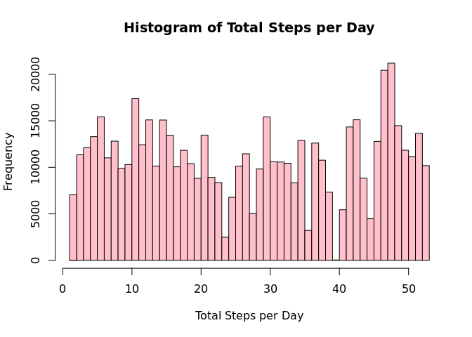
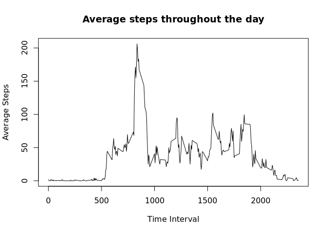
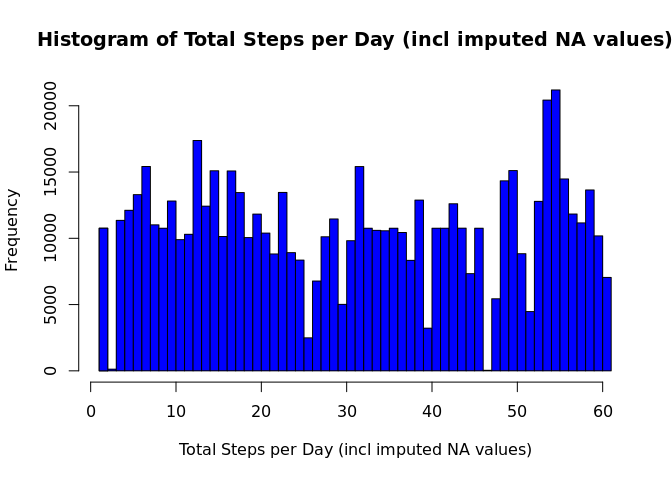
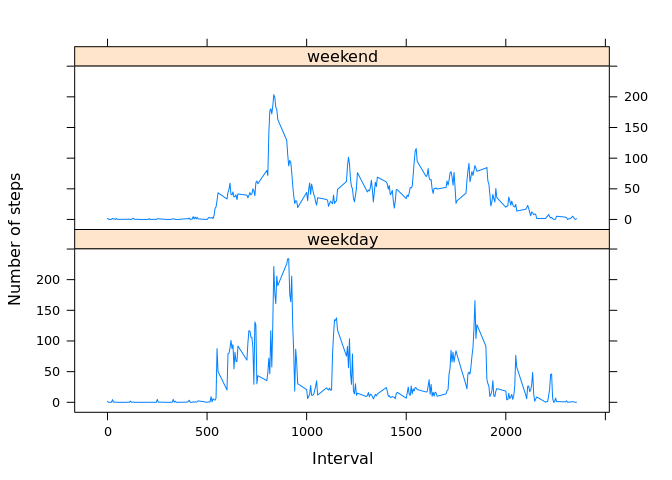

# Reproducible Research: Peer Assessment 1


## Loading and preprocessing the data

The following code is used to load the dataset located in the working directory in form of CSV. Data not available are omitted from the dataset.


```r
  activity <- read.csv("activity.csv")
```

The date are read in by lubridate package.


```r
  library(lubridate)

  activity$date <- ymd(activity$date)
```

## What is mean total number of steps taken per day?

The dataset is grouped by the date, then dplyr package is used to generate a summary table showing the sum, mean and median for each day.

After omitting the NA values, a histogram is plotted showing the frequency of steps taken each day.


```r
library(dplyr)
```

```
## 
## Attaching package: 'dplyr'
## 
## The following objects are masked from 'package:lubridate':
## 
##     intersect, setdiff, union
## 
## The following objects are masked from 'package:stats':
## 
##     filter, lag
## 
## The following objects are masked from 'package:base':
## 
##     intersect, setdiff, setequal, union
```

```r
activity <- group_by(activity, date)
activity_nona <- na.omit(activity)

activity_summary <- summarise(activity_nona, sum(steps), mean(steps), median(steps))

Total.Steps <- 1:nrow(activity_summary)
Freq <- activity_summary$`sum(steps)`
myhist <-list(breaks=Total.Steps, counts=Freq, xname="Total Steps per Day")
class(myhist) <- "histogram"
plot(myhist, col = "pink")
```

 

```r
library(knitr)

kable(activity_summary)
```


date          sum(steps)   mean(steps)   median(steps)
-----------  -----------  ------------  --------------
2012-10-02           126     0.4375000               0
2012-10-03         11352    39.4166667               0
2012-10-04         12116    42.0694444               0
2012-10-05         13294    46.1597222               0
2012-10-06         15420    53.5416667               0
2012-10-07         11015    38.2465278               0
2012-10-09         12811    44.4826389               0
2012-10-10          9900    34.3750000               0
2012-10-11         10304    35.7777778               0
2012-10-12         17382    60.3541667               0
2012-10-13         12426    43.1458333               0
2012-10-14         15098    52.4236111               0
2012-10-15         10139    35.2048611               0
2012-10-16         15084    52.3750000               0
2012-10-17         13452    46.7083333               0
2012-10-18         10056    34.9166667               0
2012-10-19         11829    41.0729167               0
2012-10-20         10395    36.0937500               0
2012-10-21          8821    30.6284722               0
2012-10-22         13460    46.7361111               0
2012-10-23          8918    30.9652778               0
2012-10-24          8355    29.0104167               0
2012-10-25          2492     8.6527778               0
2012-10-26          6778    23.5347222               0
2012-10-27         10119    35.1354167               0
2012-10-28         11458    39.7847222               0
2012-10-29          5018    17.4236111               0
2012-10-30          9819    34.0937500               0
2012-10-31         15414    53.5208333               0
2012-11-02         10600    36.8055556               0
2012-11-03         10571    36.7048611               0
2012-11-05         10439    36.2465278               0
2012-11-06          8334    28.9375000               0
2012-11-07         12883    44.7326389               0
2012-11-08          3219    11.1770833               0
2012-11-11         12608    43.7777778               0
2012-11-12         10765    37.3784722               0
2012-11-13          7336    25.4722222               0
2012-11-15            41     0.1423611               0
2012-11-16          5441    18.8923611               0
2012-11-17         14339    49.7881944               0
2012-11-18         15110    52.4652778               0
2012-11-19          8841    30.6979167               0
2012-11-20          4472    15.5277778               0
2012-11-21         12787    44.3993056               0
2012-11-22         20427    70.9270833               0
2012-11-23         21194    73.5902778               0
2012-11-24         14478    50.2708333               0
2012-11-25         11834    41.0902778               0
2012-11-26         11162    38.7569444               0
2012-11-27         13646    47.3819444               0
2012-11-28         10183    35.3576389               0
2012-11-29          7047    24.4687500               0

## What is the average daily activity pattern?

The mean step taken for each interval is aggregated and collected into a table. The aggregated table is then plotted.


```r
steps_int <- aggregate(activity_nona$steps, list(interval = activity_nona$interval), mean)
names(steps_int) [2] <- "average_steps"

plot(steps_int$interval, steps_int$average_steps, type = "l", xlab = "Time Interval", ylab = "Average Steps")
title(main = "Average steps throughout the day")
```

 

The interval with the maximun average steps is found by filtering the aggregated table.


```r
max_int <- filter(steps_int, average_steps == max(average_steps))

max_int$interval
```

```
## [1] 835
```

From the result, the interval with the most step count is 835.

## Imputing missing values

From the original dataset, a large number of NA values are present.


```r
length(is.na(activity$steps))
```

```
## [1] 17568
```

Since the NA values are linked to interval numbers and should not be dropped. Values are imputed from the rounded average value of that interval.


```r
activity_imp <- activity

for (i in 1:nrow(activity_imp)){
  
  steps <- activity_imp[i,1]
  
  if (is.na(steps)){
    
    int <- as.numeric(activity_imp[i,3])
    
      avg <- filter(steps_int, interval==int)
    
      activity_imp[i,1] <- round(avg$average_steps)
    
    } else steps
  
}
```

The imputed dataset is grouped by the date, then dplyr package is used to generate a summary table showing the sum, mean and median for each day.


```r
activity_imp <- group_by(activity_imp, date)

activity_imp_summary <- summarise(activity_imp, sum(steps), mean(steps), median(steps))

Total.Steps <- 1:nrow(activity_imp_summary)
Freq <- activity_imp_summary$`sum(steps)`
myhist_i <-list(breaks=Total.Steps, counts=Freq, xname="Total Steps per Day (incl imputed NA values)")
class(myhist_i) <- "histogram"
plot(myhist_i, col = "blue")
```

 

```r
library(knitr)

kable(activity_imp_summary)
```


date          sum(steps)   mean(steps)   median(steps)
-----------  -----------  ------------  --------------
2012-10-01         10762    37.3680556            34.5
2012-10-02           126     0.4375000             0.0
2012-10-03         11352    39.4166667             0.0
2012-10-04         12116    42.0694444             0.0
2012-10-05         13294    46.1597222             0.0
2012-10-06         15420    53.5416667             0.0
2012-10-07         11015    38.2465278             0.0
2012-10-08         10762    37.3680556            34.5
2012-10-09         12811    44.4826389             0.0
2012-10-10          9900    34.3750000             0.0
2012-10-11         10304    35.7777778             0.0
2012-10-12         17382    60.3541667             0.0
2012-10-13         12426    43.1458333             0.0
2012-10-14         15098    52.4236111             0.0
2012-10-15         10139    35.2048611             0.0
2012-10-16         15084    52.3750000             0.0
2012-10-17         13452    46.7083333             0.0
2012-10-18         10056    34.9166667             0.0
2012-10-19         11829    41.0729167             0.0
2012-10-20         10395    36.0937500             0.0
2012-10-21          8821    30.6284722             0.0
2012-10-22         13460    46.7361111             0.0
2012-10-23          8918    30.9652778             0.0
2012-10-24          8355    29.0104167             0.0
2012-10-25          2492     8.6527778             0.0
2012-10-26          6778    23.5347222             0.0
2012-10-27         10119    35.1354167             0.0
2012-10-28         11458    39.7847222             0.0
2012-10-29          5018    17.4236111             0.0
2012-10-30          9819    34.0937500             0.0
2012-10-31         15414    53.5208333             0.0
2012-11-01         10762    37.3680556            34.5
2012-11-02         10600    36.8055556             0.0
2012-11-03         10571    36.7048611             0.0
2012-11-04         10762    37.3680556            34.5
2012-11-05         10439    36.2465278             0.0
2012-11-06          8334    28.9375000             0.0
2012-11-07         12883    44.7326389             0.0
2012-11-08          3219    11.1770833             0.0
2012-11-09         10762    37.3680556            34.5
2012-11-10         10762    37.3680556            34.5
2012-11-11         12608    43.7777778             0.0
2012-11-12         10765    37.3784722             0.0
2012-11-13          7336    25.4722222             0.0
2012-11-14         10762    37.3680556            34.5
2012-11-15            41     0.1423611             0.0
2012-11-16          5441    18.8923611             0.0
2012-11-17         14339    49.7881944             0.0
2012-11-18         15110    52.4652778             0.0
2012-11-19          8841    30.6979167             0.0
2012-11-20          4472    15.5277778             0.0
2012-11-21         12787    44.3993056             0.0
2012-11-22         20427    70.9270833             0.0
2012-11-23         21194    73.5902778             0.0
2012-11-24         14478    50.2708333             0.0
2012-11-25         11834    41.0902778             0.0
2012-11-26         11162    38.7569444             0.0
2012-11-27         13646    47.3819444             0.0
2012-11-28         10183    35.3576389             0.0
2012-11-29          7047    24.4687500             0.0
2012-11-30         10762    37.3680556            34.5

To compare the estimate omitting NAs with one imputing the NAs, summaries are generated.


```r
summary(activity_summary)
```

```
##       date                       sum(steps)     mean(steps)     
##  Min.   :2012-10-02 00:00:00   Min.   :   41   Min.   : 0.1424  
##  1st Qu.:2012-10-16 00:00:00   1st Qu.: 8841   1st Qu.:30.6979  
##  Median :2012-10-29 00:00:00   Median :10765   Median :37.3785  
##  Mean   :2012-10-30 17:12:27   Mean   :10766   Mean   :37.3826  
##  3rd Qu.:2012-11-16 00:00:00   3rd Qu.:13294   3rd Qu.:46.1597  
##  Max.   :2012-11-29 00:00:00   Max.   :21194   Max.   :73.5903  
##  median(steps)
##  Min.   :0    
##  1st Qu.:0    
##  Median :0    
##  Mean   :0    
##  3rd Qu.:0    
##  Max.   :0
```

```r
summary(activity_imp_summary)
```

```
##       date              sum(steps)     mean(steps)      median(steps)   
##  Min.   :2012-10-01   Min.   :   41   Min.   : 0.1424   Min.   : 0.000  
##  1st Qu.:2012-10-16   1st Qu.: 9819   1st Qu.:34.0938   1st Qu.: 0.000  
##  Median :2012-10-31   Median :10762   Median :37.3681   Median : 0.000  
##  Mean   :2012-10-31   Mean   :10766   Mean   :37.3807   Mean   : 4.525  
##  3rd Qu.:2012-11-15   3rd Qu.:12811   3rd Qu.:44.4826   3rd Qu.: 0.000  
##  Max.   :2012-11-30   Max.   :21194   Max.   :73.5903   Max.   :34.500
```

From the summaries, it is clear that imputing NA values has little impact to the mean value since the imputation was referencing the mean values. However it would affect the median since many of the imputed NAs have non-zero values.

## Are there differences in activity patterns between weekdays and weekends?

A new variable weekday is generated from the date, to indicate whether the said day is a weekday or falls on weekend.


```r
wday <- c(2:6)

activity_imp <- mutate(activity_imp, weekday = wday(date))

suppressWarnings(activity_imp$weekday <- sapply(activity_imp$weekday, function(x){if (x == wday) as.factor("weekday") else as.factor("weekend")}))
```

The imputed dataset is subsetted into a weekday and a weekend set.


```r
activity_wd <- filter(activity_imp, weekday=="weekday")
  activity_wd <- aggregate(activity_wd$steps, list(interval = activity_wd$interval), mean)
    names(activity_wd) [2] <- "average_steps"

activity_we <- filter(activity_imp, weekday=="weekend")
  activity_we <- aggregate(activity_we$steps, list(interval = activity_we$interval), mean)
    names(activity_we) [2] <- "average_steps"

activity_wd <- mutate(activity_wd, weekday = "weekday")
activity_we <- mutate(activity_we, weekday = "weekend")
activity_w <- rbind(activity_wd, activity_we)
```

The activity pattern is plotted to compare between weekdays and weekends.


```r
library(lattice)

xyplot(average_steps~interval|weekday, data = activity_w, type="l", xlab="Interval", ylab="Number of steps", layout=c(1,2))
```

 

Comparing the patterns, it appears that the activity differs quite a lot. Apart from the peak of activity, a different pattern interms of the number of steps for a peak as well as the time such peak appears, most noticibly in the middle intervals of the graphs.
